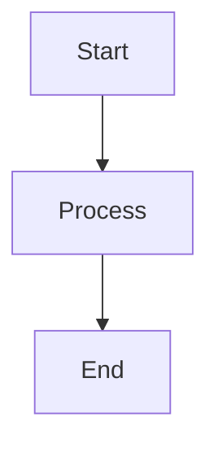

# USER STORY BUSINESS REQUIREMENT DOCUMENT

# 1. Thông tin User Story

| Thuộc tính | Giá trị |
|------------|----------|
| ID | |
| Tên User Story | |
| Module | |
| Actor | |
| Độ ưu tiên | Critical / High / Medium / Low |
| Phiên bản | |

---

# 2. User Story

**Là:** ...

**Tôi muốn:** ...

**Để:** ...

---

# 3. Mục tiêu nghiệp vụ

## Mục tiêu

- ...
- ...
- ...

## Giá trị mang lại

- ...
- ...
- ...

---

# 4. Tiền điều kiện

| STT | Điều kiện |
|------|------------|
| 1 | |
| 2 | |
| 3 | |

---

# 5. Sự kiện kích hoạt

```text
...
```

---

# 6. Hậu điều kiện

## Thành công

- ...
- ...

## Thất bại

- ...
- ...

---

# 7. Dữ liệu đầu vào

| Trường dữ liệu | Kiểu dữ liệu | Bắt buộc | Mô tả | Rule |
|---------------|-------------|----------|---------|---------|
| | | | | |

---

# 8. Dữ liệu hệ thống tự sinh

| Trường dữ liệu | Giá trị |
|---------------|----------|
| | |
| | |

---

# 9. Activity Diagram



---

# 10. Mô tả chi tiết Activity Diagram

| STT | Bước thực hiện | Tác nhân | Mô tả |
|------|------|------|------|
| 1 | | | |

---

# 11. Luồng nghiệp vụ chính

| STT | Mô tả |
|------|------|
| 1 | |

---

# 12. Luồng thay thế

| ID | Điều kiện | Mô tả |
|-----|------------|--------|
| ALT-01 | | |

---

# 13. Luồng ngoại lệ

| ID | Điều kiện | Kết quả xử lý |
|-----|------------|---------------|
| EX-01 | | |

---

# 14. Acceptance Criteria

## AC-01

### Given
...

### When
...

### Then

- ...
- ...

---

# 15. Màn hình

## 15.1 Danh sách màn hình

| Mã màn hình | Tên màn hình | Mô tả |
|------------|------------|--------|
| SCR-01 | | |

## 15.2 Mô tả màn hình

### Thông tin chung

| Thuộc tính | Giá trị |
|------------|----------|
| Tên màn hình | |
| Mục đích | |
| Đối tượng sử dụng | |

---

# 16. Business Rules

| Mã | Quy tắc |
|-----|----------|
| BR-01 | |

---

# 17. Phân quyền (RBAC)

| Chức năng | Admin | HR | User |
|------------|--------|--------|--------|
| Xem | Y/N | Y/N | Y/N |

---

# 18. Audit Logging

| Sự kiện | Action |
|----------|----------|
| Tạo mới | |

---

# 19. Edge Cases

| ID | Tình huống | Kết quả mong muốn |
|-----|------------|-------------------|
| EC-01 | | |

---

# 20. Non-Functional Requirements

| ID | Yêu cầu |
|-----|----------|
| NFR-01 | Thời gian phản hồi ≤ 3 giây |

---

# 21. Phụ thuộc hệ thống

| Hệ thống | Mục đích |
|-----------|-----------|
| ORG | |
| AD | |

---

# 22. Rủi ro nghiệp vụ

| ID | Rủi ro | Giải pháp |
|-----|---------|-----------|
| R-01 | | |

---

# 23. Tiêu chí nghiệm thu

- [ ] Đáp ứng toàn bộ Acceptance Criteria
- [ ] Đáp ứng toàn bộ Business Rules
- [ ] Đảm bảo RBAC
- [ ] Ghi nhận Audit Log
