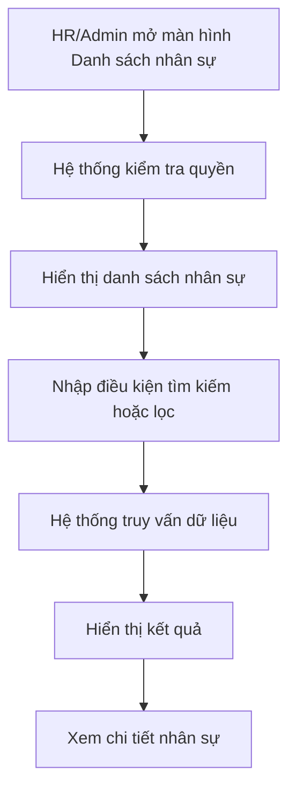


# US-01: Danh sách nhân sự

## I. Thông tin chung

| Mục | Mô tả |
|------|------|
| Tình huống sử dụng | HR/Admin truy cập danh sách nhân sự để tra cứu và quản lý nhân sự |
| Tiền điều kiện | Người dùng đã đăng nhập và có quyền xem danh sách nhân sự |
| Sự kiện kích hoạt | Người dùng truy cập menu Nhân sự → Danh sách nhân sự |
| Hậu điều kiện | Danh sách nhân sự được hiển thị theo điều kiện tìm kiếm/lọc |
| Mức độ ưu tiên | High |

---

## II. Luồng nghiệp vụ

### 1. Activity Diagram

### 2. Mô tả chi tiết Activity Diagram

| STT | Bước thực hiện | Tác nhân | Mô tả |
|------|------|------|------|
| 1 | Truy cập màn hình | HR/Admin | Mở màn hình Danh sách nhân sự |
| 2 | Kiểm tra quyền | Hệ thống | Kiểm tra RBAC |
| 3 | Tải dữ liệu | Hệ thống | Lấy danh sách nhân sự |
| 4 | Hiển thị dữ liệu | Hệ thống | Hiển thị danh sách nhân sự |
| 5 | Tìm kiếm/Lọc | HR/Admin | Nhập điều kiện tìm kiếm hoặc lọc |
| 6 | Trả kết quả | Hệ thống | Hiển thị dữ liệu phù hợp |
| 7 | Xem chi tiết | HR/Admin | Mở hồ sơ chi tiết nhân sự |

### 3. Luồng chính

| STT | Mô tả |
|------|------|
| 1 | HR/Admin truy cập màn hình Danh sách nhân sự |
| 2 | Hệ thống kiểm tra quyền truy cập |
| 3 | Hệ thống hiển thị danh sách nhân sự |
| 4 | Người dùng nhập điều kiện tìm kiếm hoặc lọc |
| 5 | Hệ thống hiển thị kết quả phù hợp |
| 6 | Người dùng chọn một nhân sự để xem chi tiết |

### 4. Luồng thay thế

| STT | Điều kiện | Mô tả |
|------|------|------|
| ALT-01 | Không nhập điều kiện tìm kiếm | Hiển thị toàn bộ dữ liệu |
| ALT-02 | Không có dữ liệu phù hợp | Hiển thị danh sách rỗng |
| ALT-03 | Thay đổi bộ lọc | Hệ thống tải lại dữ liệu |

### 5. Luồng ngoại lệ

| STT | Điều kiện | Cách xử lý |
|------|------|------|
| EX-01 | Không có quyền truy cập | Từ chối truy cập |
| EX-02 | Lỗi truy vấn dữ liệu | Hiển thị thông báo lỗi hệ thống |

---

## III. Màn hình

### 1. Wireframe mô tả các màn chức năng

| Mã màn hình | Tên màn hình | Mô tả |
|------------|------------|--------|
| SCR-01 | Danh sách nhân sự | Hiển thị danh sách nhân sự |
| SCR-02 | Chi tiết nhân sự | Hiển thị hồ sơ chi tiết nhân sự |

---

### 2. Mô tả chi tiết màn hình

#### Thông tin chung

| Thuộc tính | Giá trị |
|------------|----------|
| Tên màn hình | Danh sách nhân sự |
| Mục đích | Tra cứu và quản lý nhân sự |
| Đối tượng sử dụng | HR, Admin |

#### Danh sách trường dữ liệu

##### Bộ lọc tìm kiếm

| Trường dữ liệu | Kiểu dữ liệu | Bắt buộc | Mô tả chi tiết | Rule chi tiết |
|---------------|-------------|----------|--------|------|
| Mã nhân sự | Text | Không | Tìm kiếm theo mã nhân sự | Tìm kiếm gần đúng |
| Họ và tên | Text | Không | Tìm kiếm theo họ tên | Tìm kiếm gần đúng |
| Khoa | Dropdown | Không | Lọc theo khoa | Chọn từ danh mục |
| Phòng ban | Dropdown | Không | Lọc theo phòng ban | Chọn từ danh mục |
| Trạng thái nhân sự | Dropdown | Không | Lọc theo trạng thái | Chọn giá trị trạng thái |

##### Danh sách hiển thị

| Trường dữ liệu | Kiểu dữ liệu | Bắt buộc | Mô tả chi tiết | Rule chi tiết |
|---------------|-------------|----------|--------|------|
| Mã nhân sự | Text | Có | Mã định danh nhân sự | Chỉ đọc |
| Họ và tên | Text | Có | Họ tên nhân sự | Chỉ đọc |
| Khoa | Text | Có | Khoa trực thuộc | Chỉ đọc |
| Phòng ban | Text | Có | Phòng ban trực thuộc | Chỉ đọc |
| Ngày làm việc đầu tiên | Date | Có | Ngày bắt đầu làm việc | Chỉ đọc |
| Trạng thái nhân sự | Text | Có | Trạng thái hồ sơ | Chỉ đọc |
| Trạng thái AD | Text | Có | Trạng thái tài khoản AD | Chỉ đọc |
| Ngày tạo | Datetime | Có | Ngày tạo hồ sơ | Chỉ đọc |
| Người tạo | Text | Có | Người tạo hồ sơ | Chỉ đọc |

#### Chức năng trên màn hình

| Chức năng | Mô tả |
|-----------|--------|
| Xem chi tiết | Mở hồ sơ chi tiết nhân sự |
| Tìm kiếm | Tìm kiếm nhân sự |
| Lọc dữ liệu | Lọc dữ liệu theo điều kiện |
| Sắp xếp | Sắp xếp dữ liệu |
| Phân trang | Hiển thị dữ liệu theo trang |
| Xuất dữ liệu | Xuất danh sách nhân sự |

#### Quy tắc xử lý

| Mã quy tắc | Mô tả |
|------------|--------|
| BR-01 | Chỉ người có quyền được xem danh sách nhân sự |
| BR-02 | Dữ liệu hiển thị theo điều kiện tìm kiếm và bộ lọc |
| BR-03 | Áp dụng RBAC cho toàn bộ chức năng |
| BR-04 | Chỉ hiển thị các trạng thái nhân sự hợp lệ |

#### Thông báo hệ thống

| Trường hợp | Nội dung thông báo |
|------------|-------------------|
| Thành công | Tải dữ liệu thành công |
| Cảnh báo | Không tìm thấy dữ liệu phù hợp |
| Lỗi | Có lỗi xảy ra, vui lòng thử lại sau |

#### Phân quyền

| Chức năng | Vai trò | Quyền |
|------------|----------|--------|
| Danh sách nhân sự | Admin | Xem |
| Danh sách nhân sự | HR | Xem |
| Xem chi tiết nhân sự | Admin | Xem |
| Xem chi tiết nhân sự | HR | Xem |

#### Audit Log

| Hành động | Thông tin ghi nhận |
|------------|-------------------|
| Truy cập màn hình | Thời gian truy cập, người dùng |
| Tìm kiếm | Điều kiện tìm kiếm |
| Lọc dữ liệu | Điều kiện lọc |
| Xuất dữ liệu | Người thực hiện, thời gian thực hiện |
